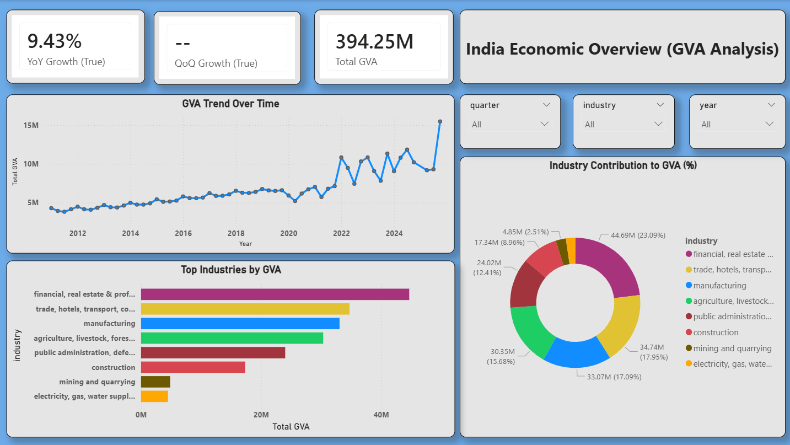
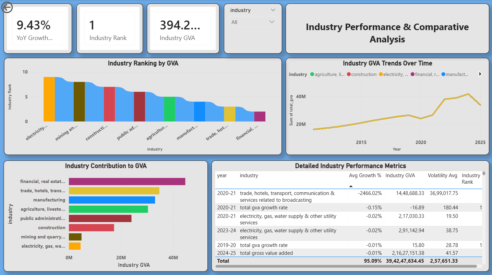
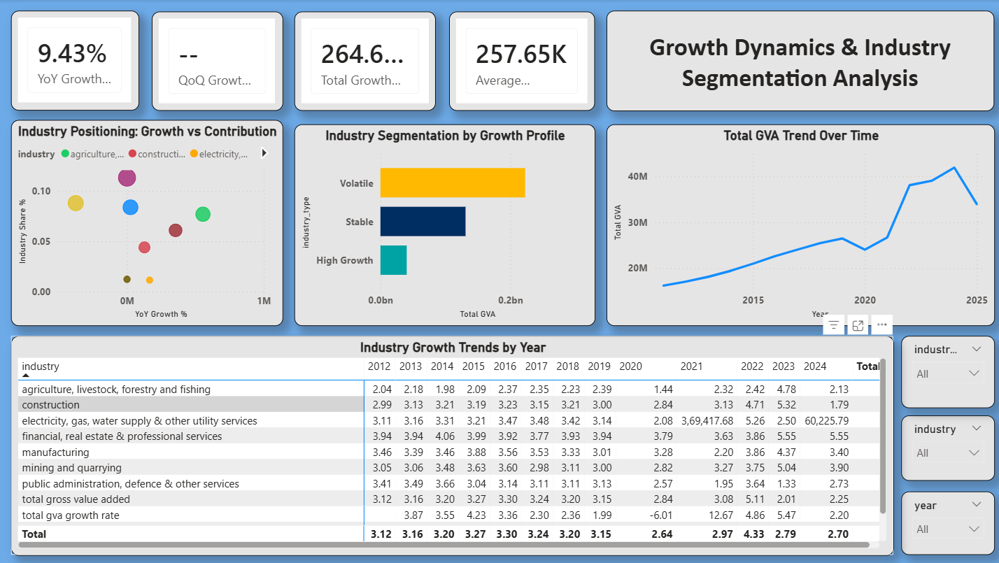

# 📊 India GDP Analysis using GVA

## 📌 Project Overview

This project analyzes India's Gross Value Added (GVA) data to understand industry-level contribution, growth trends, and economic patterns. The project includes data preprocessing, feature engineering, and an interactive Power BI dashboard.

---

## 🎯 Objectives

* Analyze GDP trends over time
* Compare industry contributions
* Calculate QoQ and YoY growth
* Identify top-performing industries
* Segment industries based on growth and stability

---

## 🧹 Data Processing

* Handled missing values using forward fill
* Created time-series date column
* Removed aggregate categories (Total GVA)
* Standardized data structure

---

## ⚙️ Feature Engineering

* Industry Share (%)
* QoQ & YoY Growth
* Industry Ranking
* Rolling Average (4Q)
* Growth Contribution

---

## 📊 Dashboard Overview

### 🔹 Page 1: Economic Overview

### 🔹 Page 2: Industry Performance

### 🔹 Page 3: Growth & Segmentation

---

## 🔍 Key Insights

* Service sector dominates GDP contribution
* High contribution does not always mean high growth
* Some industries show high volatility
* Emerging sectors show strong growth potential

---

## 🛠 Tools Used

* Python (Pandas, NumPy)
* Power BI
* DAX

---

## 📁 Project Structure

* Notebook → Data cleaning & feature engineering
* Dataset → Processed GVA data
* Dashboard → Power BI report

---

## 🚀 Conclusion

This project demonstrates how raw economic data can be transformed into actionable insights using data analytics and visualization.

---
